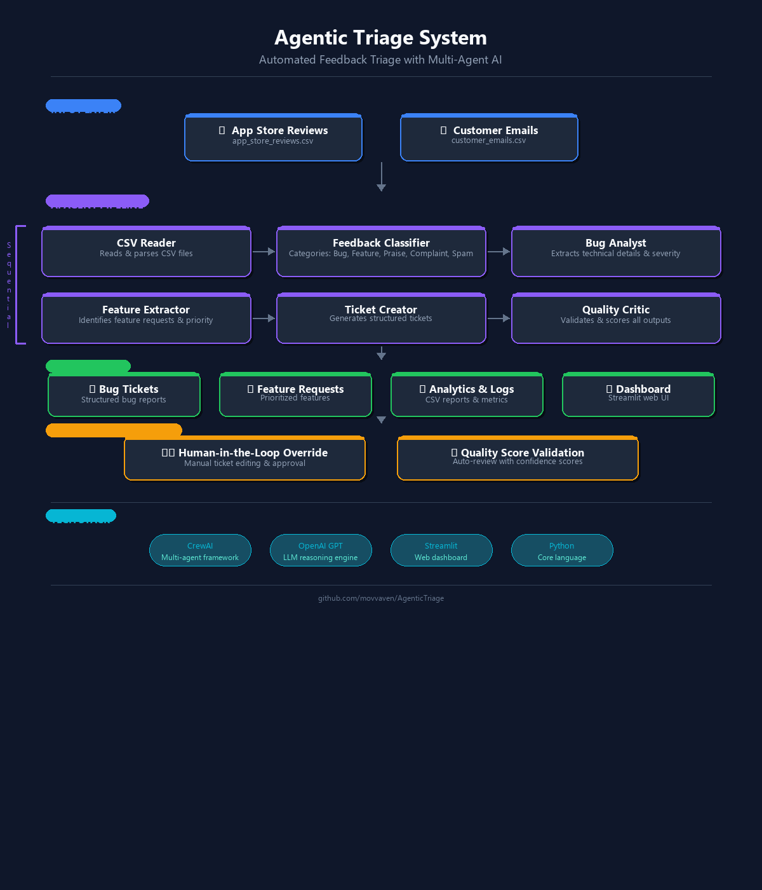
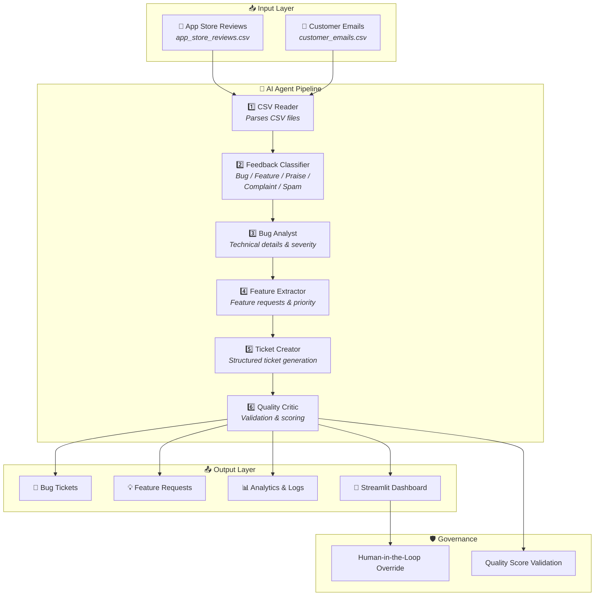

# Agentic Triage System

> **Author:** Venkat Movva
>
> A multi-agent AI system that automates the triaging of user feedback — reading app store reviews and support emails, classifying them, extracting actionable insights, and generating structured tickets with quality validation.

---

## Architecture

### Overview Diagram



### Animated Flow


### Agent Pipeline



---

## Problem Statement

Modern SaaS and app-based companies receive dozens of user reviews and feedback daily from multiple channels — app stores (Google Play, App Store), customer support emails, and user surveys. The current manual triaging process is:

- **Slow**: 1–2 hours daily of manual work
- **Inconsistent**: Varying ticket formats and prioritization
- **Error-prone**: Critical bugs get missed or delayed
- **Unscalable**: Can't keep up with growing user base

## Solution

This system uses **CrewAI** to orchestrate 6 specialized AI agents that work sequentially to:

1. **Read** user feedback from CSV files (app store reviews & support emails)
2. **Classify** content into categories (Bug / Feature Request / Praise / Complaint / Spam)
3. **Extract** actionable insights and technical details
4. **Create** structured tickets with priority levels and metadata
5. **Validate** quality and consistency through automated review
6. **Present** everything in a dashboard with manual override capability

---

## Screenshots


---

## Tech Stack

| Tool | Purpose |
|------|---------|
| **CrewAI** | Multi-agent AI framework for orchestrating specialized agents |
| **OpenAI GPT** | LLM providing reasoning for classification and analysis |
| **Streamlit** | Interactive web dashboard for monitoring and overrides |
| **Pandas** | Data display and editing in Streamlit data grids |
| **Python** | Core programming language |

---

## Setup Instructions

1. **Clone the repository**
   ```bash
   git clone https://github.com/movvaven/AgenticTriage.git
   cd AgenticTriage
   ```

2. **Create and activate a virtual environment**
   ```bash
   python -m venv venv
   source venv/bin/activate   # macOS/Linux
   venv\Scripts\activate      # Windows
   ```

3. **Install dependencies**
   ```bash
   pip install -r requirements.txt
   ```

4. **Add your API key**

   Create a `.env` file in the project root:
   ```
   OPENAI_API_KEY=your_openai_api_key
   ```

5. **Prepare input data**

   Place your CSV files in the `data/` directory:
   - `app_store_reviews.csv` — App store review data
   - `customer_emails.csv` — Customer support email data

6. **Run the app**
   ```bash
   streamlit run main.py
   ```

---

## Usage

1. Launch the app with `streamlit run main.py`
2. Click **"Start Analysis"** to read CSV data and generate tickets
3. Navigate between sections:
   - **Dashboard** — Overview of processed feedback and generated tickets
   - **Manual Override** — Edit or approve generated tickets
   - **Configuration Panel** — Adjust classification thresholds and priorities
   - **Analytics** — Processing statistics and performance metrics

---

## File Structure

```
├── main.py                 # Streamlit web application
├── crew.py                 # CrewAI agents, tasks, and tools definitions
├── helpers.py              # Helper classes, Pydantic models, utility functions
├── config/
│   ├── agents.yaml         # Agent configurations (roles, goals, backstories)
│   └── tasks.yaml          # Task definitions and dependencies
├── data/                   # Input CSV files
│   ├── app_store_reviews.csv
│   └── customer_emails.csv
├── output/                 # Generated output JSON files (runtime)
├── docs/                   # Documentation assets
│   ├── architecture_diagram.png
│   └── architecture_animated.gif
├── tools/
│   └── custom_tool.py      # Custom CrewAI tools
├── .env                    # API key configuration (not committed)
├── .gitignore
├── requirements.txt        # Python dependencies
└── README.md
```

---

## Agent Details

| # | Agent | Role |
|---|-------|------|
| 1 | **CSV Reader** | Reads and parses CSV feedback files |
| 2 | **Feedback Classifier** | Categorizes feedback into Bug, Feature Request, Praise, Complaint, or Spam |
| 3 | **Bug Analyst** | Extracts technical details, stack traces, and severity levels |
| 4 | **Feature Extractor** | Identifies feature requests and assigns priority |
| 5 | **Ticket Creator** | Generates structured tickets with metadata |
| 6 | **Quality Critic** | Reviews all outputs for accuracy and consistency |

---

## Example Output

```
Structured Analysis:
- Strengths: Speeding up triaging of large volumes of customer feedback
  and creating tickets automatically
- Weaknesses: May occasionally hallucinate ticket details — the manual
  override feature helps catch these cases
```

---

## License

This project is licensed under the terms found in the [LICENSE](LICENSE) file.

---

*Ideal for companies that care about customer feedback and want to quickly address concerns using AI-powered triage.*
